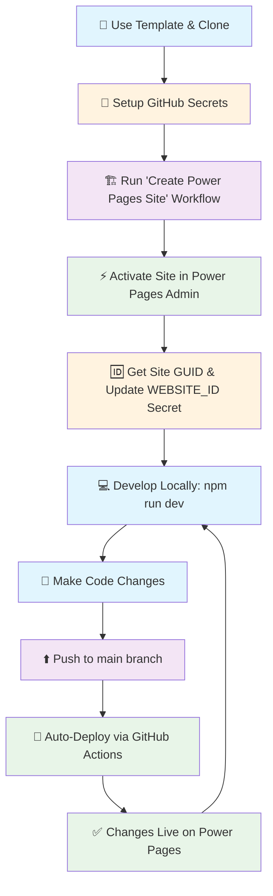
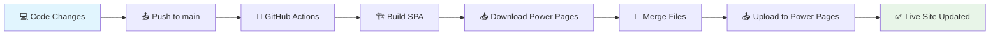

# Power Pages SPA Template 🚀

A modern template repository for building Single-Page Applications (SPA) that deploy automatically to **Microsoft Power Pages** using GitHub Actions and the Power Platform CLI.

## ✨ What's Included

- **React + Vite** - Modern development stack with hot reload
- **Power Pages Integration** - Direct deployment to Power Pages 
- **GitHub Actions** - Automated CI/CD pipeline
- **Hello World Example** - Clean starting point for your projects

## 🎯 Use This Template

1. **Click "Use this template"** to create your own repository
2. **Clone your new repository** locally
3. **Follow the setup workflow below** 👇

---

## 🔄 Complete Development Workflow



---

## 🚀 Step-by-Step Setup Guide

### Step 1: 🔐 Configure GitHub Secrets

Go to **Repository → Settings → Secrets and variables → Actions** and add these secrets:

| Secret Name | Description | Example |
|-------------|-------------|---------|
| `ENV_URL` | Your Dataverse environment URL | `https://org.crm.dynamics.com` |
| `PP_APP_ID` | Azure AD app (service principal) client ID | `12345678-1234-1234-1234-123456789012` |
| `PP_TENANT_ID` | Your Azure tenant ID | `87654321-4321-4321-4321-210987654321` |
| `PP_APP_SECRET` | Client secret for the service principal | `your-secret-value` |

> **💡 Pro Tip:** For enhanced security, consider using [OIDC authentication](https://docs.github.com/en/actions/deployment/security-hardening-your-deployments/about-security-hardening-with-openid-connect) instead of client secrets.

### Step 2: 🏗️ Create Your Power Pages Site

1. Go to **Actions** tab in your repository
2. Select **"Create Power Pages SPA (one-time)"** workflow
3. Click **"Run workflow"** → **"Run workflow"**
4. Wait for the workflow to complete (creates your Power Pages site)

### Step 3: ⚡ Activate Your Site

1. Open [Power Pages Admin Center](https://make.powerpages.microsoft.com/)
2. Navigate to **"Inactive sites"**
3. Find your newly created site
4. Click **"Activate"** to make it live

### Step 4: 🆔 Get Site GUID and Update Secret

1. In Power Pages Admin, click on your activated site
2. Copy the **Site GUID** from the URL or site details
   ```
   Example URL: https://make.powerpages.microsoft.com/environments/env-id/sites/SITE-GUID-HERE
   ```
3. Go back to **GitHub → Settings → Secrets and variables → Actions**
4. Add a new secret:
   - **Name:** `WEBSITE_ID`
   - **Value:** `your-site-guid-here`

### Step 5: 💻 Start Developing!

```bash
# Clone your repository
git clone https://github.com/yourusername/your-repo-name.git
cd your-repo-name

# Install dependencies
npm install

# Start development server
npm run dev        # Opens http://localhost:5173
```

### Step 6: 🔄 Automatic Deployment

Once setup is complete, every push to the `main` branch will:

1. **Build** your React SPA
2. **Download** the current Power Pages site structure
3. **Merge** your built SPA with Power Pages files
4. **Upload** the combined files back to Power Pages
5. **Update** your live site automatically! 🎉

---

## 🛠️ Local Development

```bash
# Install dependencies
npm install

# Start development server with hot reload
npm run dev        # Opens http://localhost:5173

# Build for production  
npm run build      # Outputs to /dist folder
```

## 📁 Project Structure

```
powerpages-spa-template/
├── 📁 .github/workflows/     # GitHub Actions automation
│   ├── 🔄 deploy.yml         # Main deployment workflow
│   └── 🏗️ create-site.yml    # One-time site creation
├── 📁 src/                   # React application source
│   ├── 📄 App.jsx            # Main Hello World component
│   └── 📄 main.jsx           # Application entry point
├── 📁 public/                # Static assets (logos, images)
├── 📁 docs/                  # Documentation and guides
├── 📄 powerpages.config.json # Power Pages deployment config
├── 📄 vite.config.js         # Vite build configuration
└── 📄 package.json           # Dependencies and scripts
```

## 🎨 Customization Guide

### Modify the Hello World Page
Edit `/src/App.jsx` to customize:
- Colors and styling
- Content and messaging  
- Features and layout
- Add your branding

### Add New Components
Create new React components in `/src/` and import them in your app.

### Update Branding
- Replace logos in `/public/assets/`
- Modify the page title in `/index.html`
- Update colors in the component styles

### Configure Power Pages Settings
Edit `powerpages.config.json` to modify:
- Site name and landing page
- Build output paths
- Deployment parameters

## 🚀 Advanced Deployment

### 🤖 Automated Workflow Details


### 🔧 Manual Deployment (Advanced Users)
```bash
# Authenticate with Power Platform
pac auth create --kind DATAVERSE --url "<ENV_URL>" --applicationId "<APP_ID>" --clientSecret "<SECRET>" --tenant "<TENANT_ID>"

# Build and upload your site
npm run build
pac pages upload-code-site --rootPath .
```

## 🔍 Troubleshooting Guide

### Common Issues & Solutions

| Issue | Symptoms | Solution |
|-------|----------|----------|
| 🔐 **Authentication Failed** | Workflow fails with auth errors | ✅ Verify all GitHub secrets are correctly set |
| 🌐 **Site Not Found** | "Site GUID not found" error | ✅ Ensure WEBSITE_ID secret matches activated site GUID |
| 🏗️ **Build Failed** | npm build errors in workflow | ✅ Test `npm run build` locally first |
| 📤 **Upload Errors** | PAC CLI upload failures | ✅ Check service principal Power Pages permissions |
| 🔄 **Workflow Not Triggered** | No auto-deployment on push | ✅ Ensure push is to `main` branch |

### Debug Steps

1. **Check GitHub Actions logs** in the Actions tab for detailed error messages
2. **Verify all secrets** are properly configured in repository settings
3. **Test locally** with `npm run dev` and `npm run build`
4. **Validate permissions** - ensure your service principal can access Power Pages
5. **Check Power Pages Admin** to confirm site is activated and accessible

### Getting Help

- 📖 **Documentation**: Check `/docs` folder for detailed guides
- 🐛 **Issues**: Review workflow logs in GitHub Actions tab
- 💬 **Community**: Visit [Power Pages Community](https://powerusers.microsoft.com/t5/Power-Pages-Community/ct-p/PowerPagesCommunity)

## 📚 Additional Resources

### Microsoft Documentation
- [Power Pages Documentation](https://docs.microsoft.com/power-pages/)
- [Power Platform CLI Reference](https://docs.microsoft.com/power-platform/developer/cli/introduction)
- [Service Principal Setup Guide](https://docs.microsoft.com/power-platform/admin/powershell-create-service-principal)

### Development Resources  
- [React Documentation](https://reactjs.org/)
- [Vite Documentation](https://vitejs.dev/)
- [GitHub Actions Guide](https://docs.github.com/actions)

### Power Pages Learning
- [Power Pages Learning Path](https://docs.microsoft.com/learn/paths/power-pages-get-started/)
- [Architecture Best Practices](https://docs.microsoft.com/power-pages/architecture/overview)

## 🤝 Contributing to This Template

We welcome contributions to improve this template!

### How to Contribute
1. **Fork** this template repository
2. **Create** your feature branch (`git checkout -b feature/amazing-improvement`)
3. **Commit** your changes (`git commit -m 'Add amazing improvement'`)
4. **Push** to the branch (`git push origin feature/amazing-improvement`)
5. **Open** a Pull Request with a clear description

### Contribution Guidelines
- 🧪 Test your changes locally before submitting
- 📝 Update documentation for any new features
- 🎯 Keep changes focused and atomic
- ✅ Ensure all workflows still pass

## 📄 License

This template is available under the [MIT License](LICENSE).

---

**🎉 Happy Building!** Create amazing Power Pages applications with this modern template.

> **💡 Pro Tip:** Star this repository to stay updated with new features and improvements!
